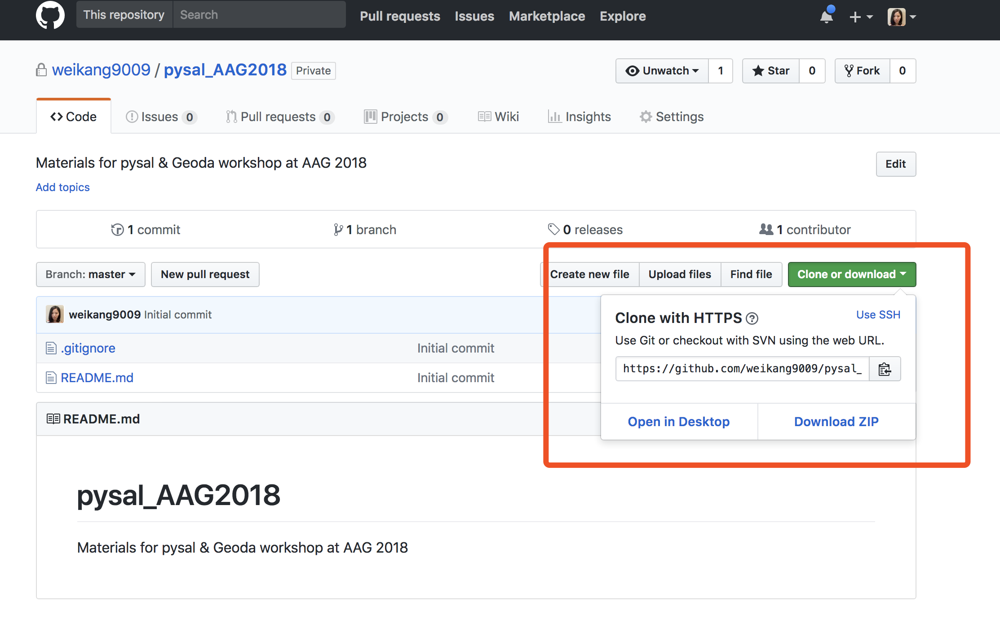
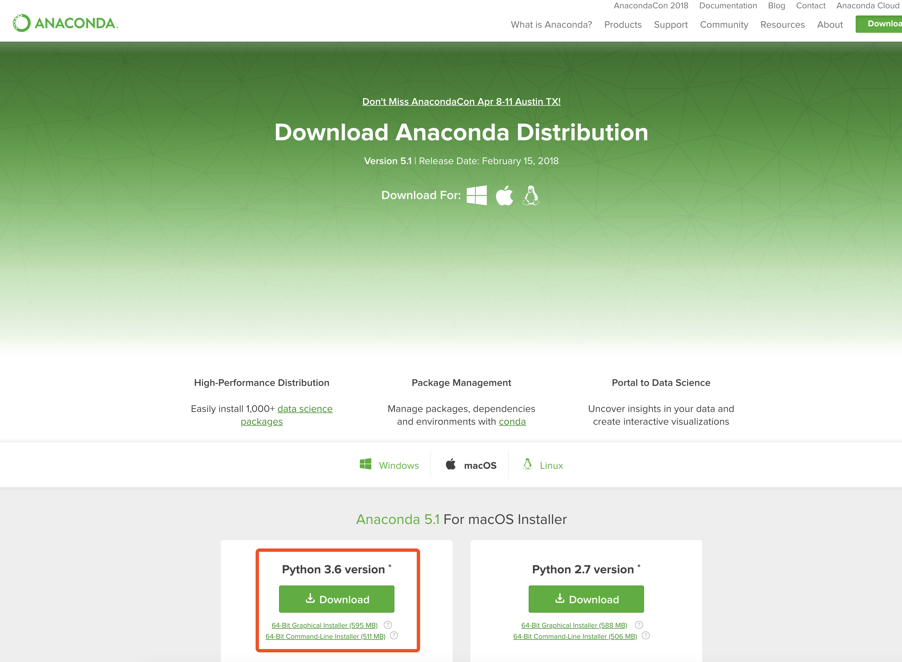
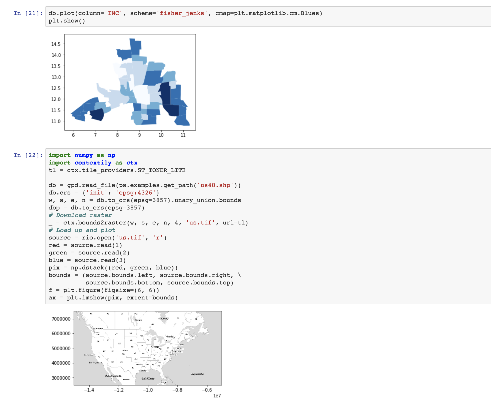

# Spatial Data Science with PyData

### Instructors

- [Levi John Wolf](https://ljwolf.org) - [University of Bristol](http://www.bristol.ac.uk/geography/levi-j-wolf/overview.html)
- Sergio Rey - [Center for Geospatial Sciences, University of California, Riverside](http://spatial.ucr.edu/peopleRey.html)

### In collaboration with

- [Dani Arribas-Bel](http://darribas.org/) -  University of Liverpool
- [Wei Kang](http://spatial.ucr.edu/peopleKang.html)
- [Marynia Kolak](https://marynia.me)
- [Joris Van den Bossche](https://jorisvandenbossche.github.io/) - Ghent University 

This repository contains the materials and instructions for the Spatial Data Science with PyData workshop at [Geopython 2018](http://2018.geopython.net/#w0).

## Outline of Workshop

[](https://mybinder.org/v2/gh/ljwolf/geopython/master)

- 13:30 - 14:25: **Representing spatial relationships for Data Science** Here, we will discuss various methods for representing spatial relationships; differences in representations; how to build/construct these in Python using PySAL and scipy; how to use them for basic statistics & exploratory analysis. 
- 10 Minute Break
- 14:35 - 15:30: **Using spatial information to build better models**: Here, we will use these spatial relationships to analyze data & fit better models or models in situations where we do not assume that sites exist in an isometric plane with no interrelationships.

## Obtaining Workshop Materials

The preferred method for attending the workshop is to get a local installation of the software packages running on your own computer. 
This makes it simple for you to take what you've learned and apply it in your own work. 
As a secondary alternative, we suggest you consider the directions provided by [@darribas](https://twitter.com/darribas) about [the Geographic Data Science software stack, made available on docker.](https://github.com/darribas/gds_env).

If you are familiar with GitHub, you should clone or fork this GitHub repository to a specific directory. Cloning can be done by:

```bash
git clone https://github.com/ljwolf/geopython.git
```

If you are not using git, you can grab the workshop materials as a zip file by pointing your browser to (https://github.com/ljwolf/geopython) and clicking on the green *Clone or download* button in the upper right.



Extract the downloaded zip file to a working directory.

## New to Command Line

Are you not sure how to access a working directory or command line? For this workshop, we recommend starting with two points:

1. find your Terminal,
2. Learn to Change Your Working Directory.

For those who have MacOS operating systems, you can find Terminal in your Utilities. For those using other operating systems, search for multiple options online, depending on your taste. 
Once in your terminal, type ```ls```. This will list all of the contents in your current directory. You will likely see your Data, Documents, Desktop, Download, and many other folders and files. 

To change working directories, you will type ```cd``` plus the name of the directory you'd like to change to. If you are diving into a subdirectory, or child of the directory you were just in, then that name on its own is sufficient. For example, to access the "Downloads" directory, you type ```cd Downloads```.

If you just downloaded the zip file into Downloads, first make sure you have unzipped the folder. Once unzipped, assuming it is still in the Downloads directory, type ```cd geopython``` to access. Then ```ls``` to list the contents. You have successfully navigated to your working directory to the workshop, and are ready for installations!

## Installation

We will be using a number of Python packages for geospatial analysis. 

**Please make sure to do these setup steps before attending the conference!**

### Setting up the environment

An easy way to install all of these packages is to use a Python distribution such as [Anaconda](https://www.anaconda.com/download/#macos). In this workshop we will be using **Python 3.6** so please download that version of Anaconda. 

- [Installing on Windows](https://docs.anaconda.com/anaconda/install/windows)
- [Installing on Mac](https://docs.anaconda.com/anaconda/install/mac-os)



Once you have downloaded Anaconda, start a terminal and navigate to the directory of the downloaded/ cloned materials. If you just learned to navigate to your working directory in the tutorial above, you are ready for the next step, which sets up the environment for the workshop, grabbing all the required packages: 

```bash
conda-env create -f gds_stack.yml
```

This will build a conda environment that sandboxes the installation of the required packages for this workshop so we don't break anything in your computer's system Python (if it has one).

This may take up to 10-15 minutes to complete depending on the speed of your network connection.

Once this completes, you can activate the workshop environment with:

* on Mac, Linux, or Windows for conda 4.4+
```bash
conda activate gds
```
* on Mac, Linux for conda <4.4
```bash
source activate gds
```
* on Windows for conda <4.4
```bash
activate gds
```


###
Next, you will want to test your installation with:
```bash
 jupyter-nbconvert --execute --ExecutePreprocessor.timeout=120 check_py_stack.ipynb
```

You should see something like:
```bash
[NbConvertApp] Converting notebook check_py_stack.ipynb to html
[NbConvertApp] Executing notebook with kernel: python3
[NbConvertApp] Writing 393375 bytes to check_py_stack.html
```

Open check_workshop.html in a browser, and scroll all the way down, you should see something like:



If you do see the above, you are ready for the workshop.
