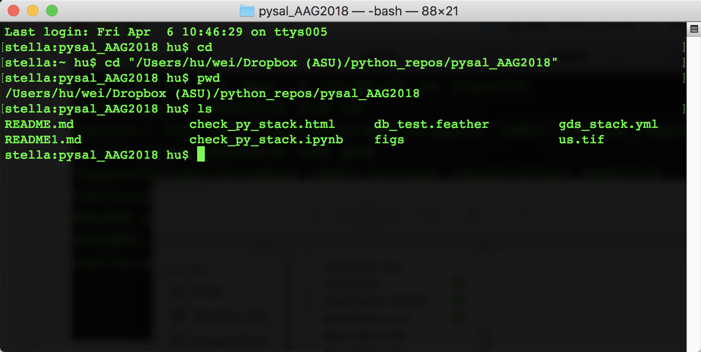

# Open-Source Spatial Statistics workshop at AAG 2018

### Instructors

- [Dani Arribas-Bel](http://darribas.org/) -  University of Liverpool
- [Levi John Wolf](http://www.bristol.ac.uk/geography/people/levi-j-wolf/overview.html) - University of Bristol
- [Marynia Kolak](https://marynia.me/) - University of Chicago
- [Wei Kang](http://spatial.ucr.edu/peopleKang.html) - Arizona State University


This repository contains the materials and instructions for the PySAL workshop at [NARSC 2017](http://www.narsc.org/newsite/conference/workshops-and-tutorials/).


## Schedule

* 10:00-12:00

## Obtaining Workshop Materials

If you are familiar with GitHub, you should clone or fork this GitHub repository to a specific directory. Cloning can be done by:

```bash
git clone https://github.com/weikang9009/pysal_AAG2018.git
```

If you are not using git, you can grab the workshop materials as a zip file by pointing your browser to (https://github.com/weikang9009/pysal_AAG2018) and clicking on the green *Clone or download* button in the upper right.


Extract the downloaded zip file to a working directory.

## Installation

We will be using a number of Python packages for geospatial analysis.

An easy way to install all of these packages is to use a Python distribution such as [Anaconda](https://www.anaconda.com/download/#macos). In this workshop we will be using **Python 3.6** so please download that version of Anaconda.


Once you have downloaded Anaconda, start a terminal and navigate to the directory of the downloaded/ cloned materials. For example, if the materials now live in the directory ```/Users/hu/wei/Dropbox (ASU)/python_repos/pysal_AAG2018```, you need to navigate to that directory from the terminal (using command ```cd```):



Once we have done that, run:

```bash
conda-env create -f gds_stack.yml
```

This will build a conda environment that sandboxes the installation of the required packages for this workshop so we don't break anything in your computer's system Python (if it has one).

This may take 10-15 minutes to complete depending on the speed of your network connection.

Once this completes, you can activate the workshop environment with:

* on Mac, Linux
```bash
source activate gds
```
* on Windows:
```bash
activate gds
```

Next, you will want to test your installation with:
```bash
 jupyter-nbconvert --execute --ExecutePreprocessor.timeout=120 check_workshop.ipynb
```

You should see something like:
```bash
[NbConvertApp] Converting notebook check_py_stack.ipynb to html
[NbConvertApp] Executing notebook with kernel: python3
[NbConvertApp] Writing 393375 bytes to check_py_stack.html
```

Open check_workshop.html in a browser, and scroll all the way down, you should see something like:


If you do see the above, you are ready for the workshop.
